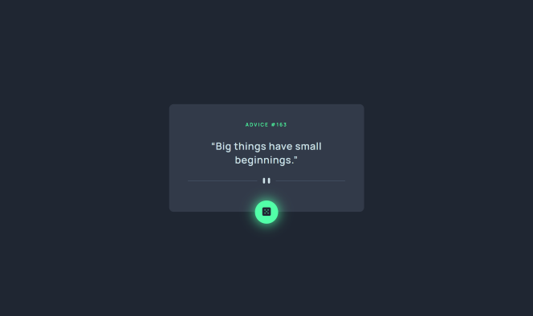

# Quote Generator App - React

 

This web app generates a first quote on window load, after that the user can generate random quotes when pressing the green generator button. For this project, I wanted to specifically work on React custom hooks.

View Live Demo: [Click]((https://quotegenerator-rammy.vercel.app/))

## 'useFetch' custom hook
For the api call I created a custom hook called 'useFetch' that takes a single argument, 'url', representing the URL to fetch data from.

The hook sets up a state object using the useState hook, which initially has two properties: 'data' that is set to null and 'isLoading' that is set to true.

The fetchData function makes a request to the specified URL using the Fetch API. The hook extracts the 'slip' property from the JSON data using destructuring after receiving the response. Then it updates the state using setState to store the extracted slip data and sets isLoading to false to indicate that the data has finished loading.

The hook uses the useEffect hook to make the fetch request when the component using the hook is rendered for the first time or whenever the url argument changes.

This custom hook returns an object containing the current data, isLoading, and fetchData properties of the state. This allows a component that uses the useFetch hook to access the fetched data, the loading state, and the fetch function.

Finally, the 'QuoteApp' component uses the 'useFetch' hook to fetch data from the  URL. The hook returns the fetched data, a boolean flag indicating whether the data is still being loaded, and the fetchData function.

The component destructures the hook's returned values into data, fetchData, and isLoading variables. The data object is destructured again into two properties, id and advice once the data is not null. As for the fetchData function, it is passed as a prop to the 'Button' component, which will trigger a new fetch request and update the data when the button is clicked.

